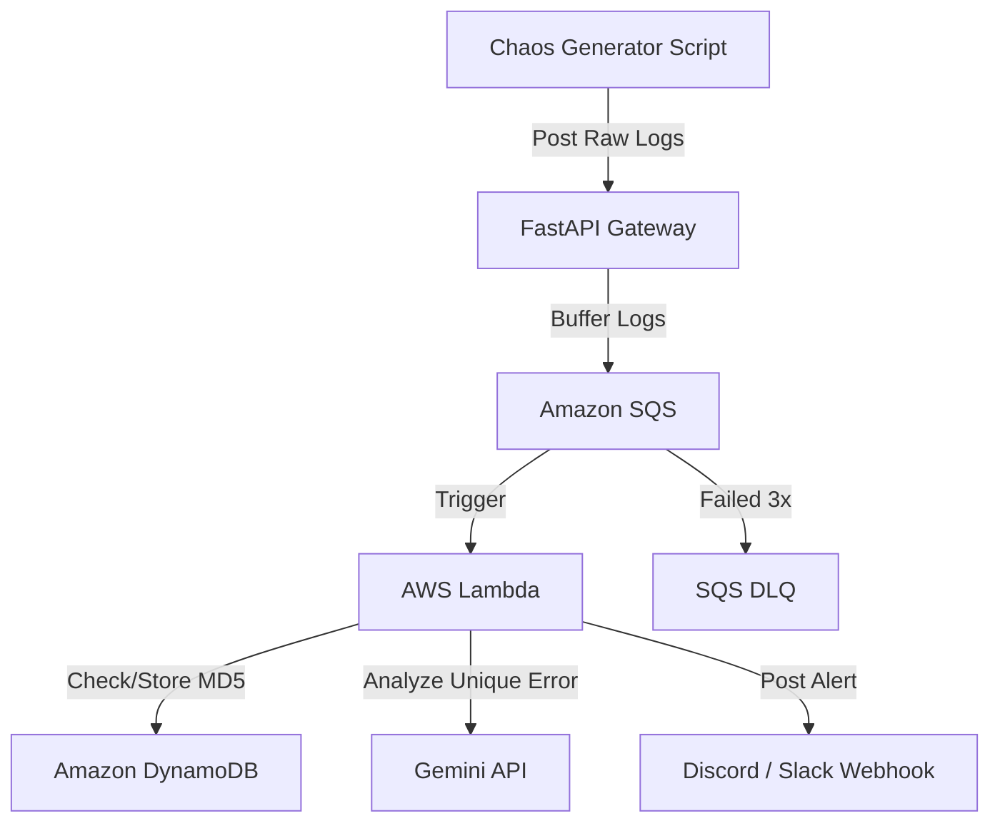

# AI Log Deduper

A simple project to catch messy, multi-line application error logs and filter out duplicates so you don't get spammed with the same alerts. It uses FastAPI as an ingestion gateway, AWS SQS and Lambda for processing, DynamoDB to check for duplicate errors, and the Gemini API to summarize unique bugs before sending a notification to Discord or Slack.

## Architecture



## Project Structure

```text
ai-log-deduper/
├── chaos_generator/      # Script to generate fake error logs for testing
│   ├── chaos.py
│   └── requirements.txt
├── gateway/              # FastAPI app to ingest logs and pass them to SQS
│   ├── Dockerfile
│   ├── main.py
│   └── requirements.txt
├── lambda/               # AWS Lambda function that handles deduplication
│   ├── lambda_function.py
│   └── requirements.txt
├── terraform/            # Infrastructure files to spin up AWS resources
│   ├── main.tf
│   ├── providers.tf
│   ├── variables.tf
│   └── outputs.tf
├── .env.example          # Template for local environment setup
├── .gitignore
└── README.md
```

## How the Components Work

chaos_generator: A basic Python script that spits out random, messy errors and stack traces so we actually have logs to test the pipeline with.

gateway: A tiny FastAPI app running in a Docker container. It takes incoming logs from your apps and drops them straight into an SQS queue so the backend doesn't crash during a heavy traffic spike.

sqs: Buffers logs to absorb traffic spikes. It includes a Dead Letter Queue (DLQ) with a maxReceiveCount of 3 and a redrive allow policy to isolate repeatedly failing messages safely without data loss.

lambda: The core engine. It grabs messages from SQS, hashes the log content, and checks DynamoDB to see if we've seen it before. If it's a completely new error, it passes it to Gemini for a quick root-cause summary and hits a Discord/Slack webhook.

ssm: Securely stores sensitive API keys and webhook URLs as encrypted parameters (SecureString), which Lambda retrieves at runtime.

terraform: Contains the files needed to spin up all the AWS infrastructure (SQS queues, Lambda functions, DynamoDB tables, roles, and a custom CloudWatch dashboard for monitoring) automatically without dealing with the AWS console manually.

## API Documentation & Local Testing

When running the FastAPI gateway locally, you can access the interactive Swagger UI to view and test the API endpoints. Open your web browser and navigate to http://127.0.0.1:8000/docs to interact with the API documentation.

## Local setup & offline testing

Run everything locally from scratch:

1. Make the init script executable and start the LocalStack container (this pulls the localstack/localstack:3.8.0 image and maps SQS, DynamoDB, and SSM services to port 4566):
```bash
chmod +x localstack-init.sh
docker compose up -d
```

2. Install dependencies:
```bash
source venv/bin/activate
pip install -r gateway/requirements.txt
pip install -r chaos_generator/requirements.txt
```

3. Set env vars and boot the gateway:
```bash
export AWS_ACCESS_KEY_ID=mock
export AWS_SECRET_ACCESS_KEY=mock
export AWS_REGION=us-east-1
export AWS_ENDPOINT_URL=http://localhost:4566
export SQS_QUEUE_URL=http://sqs.us-east-1.localhost.localstack.cloud:4566/000000000000/ai-log-deduper-queue

uvicorn gateway.main:app --port 8000
```

4. Send a manual test log to the gateway (in a separate terminal):
```bash
curl -X POST http://127.0.0.1:8000/logs -H "Content-Type: application/json" -d '{"service": "local-test", "log": "Offline stack test error"}'
```

5. Verify the message is in SQS:
```bash
docker exec -it ai-log-deduper-localstack awslocal sqs receive-message --queue-url http://sqs.us-east-1.localhost.localstack.cloud:4566/000000000000/ai-log-deduper-queue
```

6. Set your Discord webhook parameter in LocalStack (optional):
```bash
docker exec -it ai-log-deduper-localstack awslocal ssm put-parameter \
  --name "/ai-log-deduper/discord_webhook_url" \
  --type "SecureString" \
  --value "YOUR_REAL_DISCORD_WEBHOOK_URL" \
  --overwrite
```

7. Run the local SQS-to-Lambda runner to process queue messages (in a separate terminal):
```bash
source venv/bin/activate
python lambda_local_runner.py
```

8. Stream continuous fake errors using the chaos generator (in a separate terminal):
```bash
source venv/bin/activate
python chaos_generator/chaos.py
```


## CI/CD Pipeline & Automated Testing

The project uses GitHub Actions for CI/CD. The pipeline triggers on push to master and runs the following stages:

1. Linting: Runs Ruff to check code standards.
2. Testing: Runs the mocked Pytest suite for the gateway and Lambda processor.
3. Security Scanning: Runs TFLint, Checkov, and Trivy to find vulnerabilities and misconfigurations.
4. Build & Push: Builds the FastAPI gateway container and pushes to GHCR.
5. Deploy: Runs Terraform to apply infrastructure changes in AWS.

If linting, tests, or scans fail, the pipeline blocks the build and stops the deployment.


## Production Deployment

To deploy this pipeline to your own AWS account:

1. Create your own remote Terraform backend:
   - Navigate to `terraform/bootstrap/` and run `terraform apply` to create your S3 state bucket and DynamoDB lock table.
   - Update `terraform/backend.tf` with your newly created S3 bucket name.

2. Configure GitHub Secrets in your repository:
   - `AWS_ACCESS_KEY_ID` & `AWS_SECRET_ACCESS_KEY`
   - `GEMINI_API_KEY` (Gemini API access, optional. If omitted, the pipeline falls back to sending raw log alerts)
   - `DISCORD_WEBHOOK_URL` (Target channel webhook)

3. Push to `master` to trigger the automated CI/CD pipeline.

## Local customization & port conflicts

If port 8000 is already in use by another application on your machine:

1. Boot the gateway on a different port:
```bash
uvicorn gateway.main:app --port 8080
```

2. Configure the chaos generator to point to the new port:
```bash
export GATEWAY_URL=http://localhost:8080/logs
python chaos_generator/chaos.py
```


