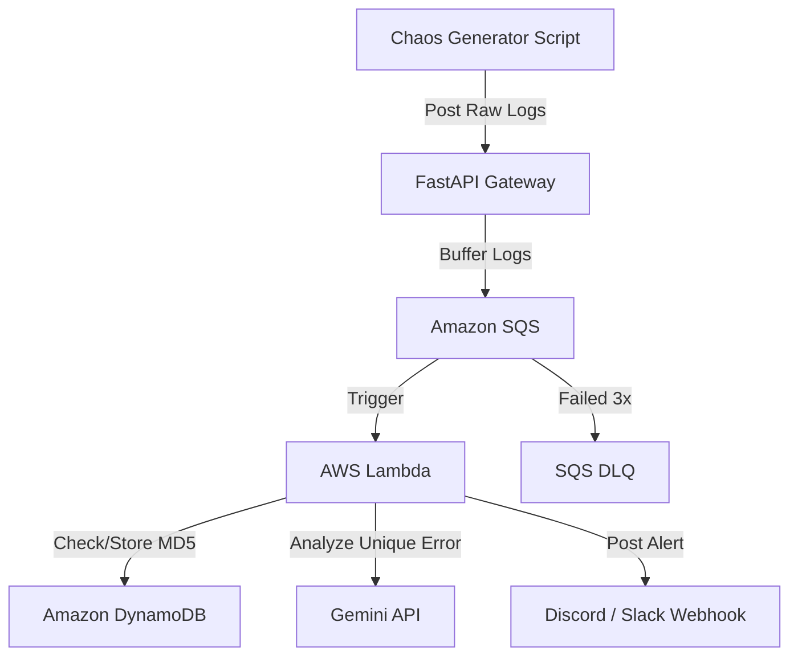

# AI Log Deduper

A tool to ingest multi-line application error logs, filter out duplicates, and send clean alerts. It uses FastAPI as an ingestion gateway, AWS SQS and Lambda for processing, DynamoDB to check for duplicates, and the Gemini API to summarize unique errors before posting to Discord or Slack.

## Architecture



[Here's the full Project Journey & Troubleshooting Log to see how this architecture was built and debugged.](./project.md)

## API Documentation & Local Testing

When running the FastAPI gateway locally, you can access the interactive Swagger UI to view and test the API endpoints. Open your web browser and navigate to http://127.0.0.1:8000/docs to interact with the API documentation.

## Local setup & offline testing

Run everything locally from scratch:

1. Make the init script executable and start the LocalStack container (this pulls the localstack/localstack:3.8.0 image and maps SQS, DynamoDB, and SSM services to port 4566):
```bash
chmod +x localstack-init.sh
docker compose up -d
```

2. Install dependencies:
```bash
source venv/bin/activate
pip install -r gateway/requirements.txt
pip install -r chaos_generator/requirements.txt
```

3. Set env vars and boot the gateway:
```bash
export AWS_ACCESS_KEY_ID=mock
export AWS_SECRET_ACCESS_KEY=mock
export AWS_REGION=us-east-1
export AWS_ENDPOINT_URL=http://localhost:4566
export SQS_QUEUE_URL=http://sqs.us-east-1.localhost.localstack.cloud:4566/000000000000/ai-log-deduper-queue

uvicorn gateway.main:app --port 8000
```

4. Send a manual test log to the gateway (in a separate terminal):
```bash
curl -X POST http://127.0.0.1:8000/logs -H "Content-Type: application/json" -d '{"service": "local-test", "log": "Offline stack test error"}'
```

5. Verify the message is in SQS:
```bash
docker exec -it ai-log-deduper-localstack awslocal sqs receive-message --queue-url http://sqs.us-east-1.localhost.localstack.cloud:4566/000000000000/ai-log-deduper-queue
```

6. Set your Discord webhook parameter in LocalStack (optional):
```bash
docker exec -it ai-log-deduper-localstack awslocal ssm put-parameter \
  --name "/ai-log-deduper/discord_webhook_url" \
  --type "SecureString" \
  --value "YOUR_REAL_DISCORD_WEBHOOK_URL" \
  --overwrite
```

7. Run the local SQS-to-Lambda runner to process queue messages (in a separate terminal):
```bash
source venv/bin/activate
python lambda_local_runner.py
```

8. Stream continuous fake errors using the chaos generator (in a separate terminal):
```bash
source venv/bin/activate
python chaos_generator/chaos.py
```

### Testing against the live cloud deployment

To run the chaos generator against the live FastAPI gateway hosted on EC2:

1. Get the public IP of your EC2 instance from the Terraform outputs:
```bash
terraform output gateway_instance_public_ip
```

2. Export the gateway URL pointing to the live instance:
```bash
export GATEWAY_URL="http://<EC2_PUBLIC_IP>:8000/logs"
```

3. Run the chaos generator to stream errors to the live EC2 gateway:
```bash
source venv/bin/activate
python chaos_generator/chaos.py
```


## CI/CD Pipeline & Automated Testing

The project uses GitHub Actions for CI/CD. The pipeline triggers on push to master and runs the following stages:

1. Linting: Runs Ruff to check code standards.
2. Testing: Runs the mocked Pytest suite for the gateway and Lambda processor.
3. Security Scanning: Runs TFLint, Checkov, and Trivy to find vulnerabilities and misconfigurations.
4. Build & Push: Builds the FastAPI gateway container and pushes to GHCR.
5. Deploy: Runs Terraform to apply infrastructure changes in AWS.

If linting, tests, or scans fail, the pipeline blocks the build and stops the deployment.


## Production Deployment

To deploy this pipeline to your own AWS account:

1. Create your own remote Terraform backend (this is decoupled in a separate bootstrap folder to prevent `terraform destroy` from deleting your state storage):
   - Navigate to `terraform/bootstrap/` and run `terraform apply` to create your S3 state bucket and DynamoDB lock table.
   - Update `terraform/backend.tf` with your newly created S3 bucket name.

2. Configure GitHub Secrets in your repository:
   - `AWS_ACCESS_KEY_ID` & `AWS_SECRET_ACCESS_KEY`
   - `GEMINI_API_KEY` (Gemini API access, optional. If omitted, the pipeline falls back to sending raw log alerts)
   - `DISCORD_WEBHOOK_URL` (Target channel webhook)

3. Push to `master` to trigger the automated CI/CD pipeline.

## Local customization & port conflicts

If port 8000 is already in use by another application on your machine:

1. Boot the gateway on a different port:
```bash
uvicorn gateway.main:app --port 8080
```

2. Configure the chaos generator to point to the new port:
```bash
export GATEWAY_URL=http://localhost:8080/logs
python chaos_generator/chaos.py
```


