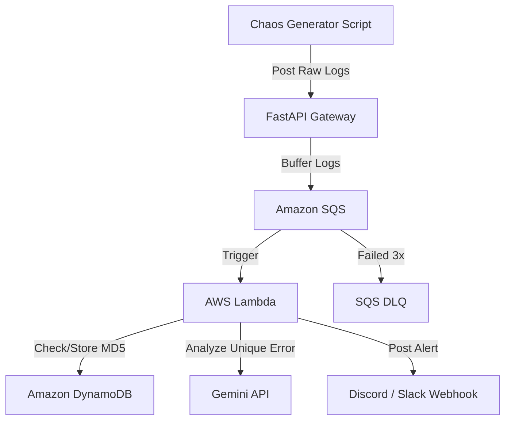

# AI Log Deduper

A simple project to catch messy, multi-line application error logs and filter out duplicates so you don't get spammed with the same alerts. It uses FastAPI as an ingestion gateway, AWS SQS and Lambda for processing, DynamoDB to check for duplicate errors, and the Gemini API to summarize unique bugs before sending a notification to Discord or Slack.

## Architecture



## Project Structure

```text
ai-log-deduper/
├── chaos_generator/      # Script to generate fake error logs for testing
│   ├── chaos.py
│   └── requirements.txt
├── gateway/              # FastAPI app to ingest logs and pass them to SQS
│   ├── Dockerfile
│   ├── main.py
│   └── requirements.txt
├── lambda/               # AWS Lambda function that handles deduplication
│   ├── lambda_function.py
│   └── requirements.txt
├── terraform/            # Infrastructure files to spin up AWS resources
│   ├── main.tf
│   ├── providers.tf
│   ├── variables.tf
│   └── outputs.tf
├── .env.example          # Template for local environment setup
├── .gitignore
└── README.md
```

## How the Components Work

chaos_generator: A basic Python script that spits out random, messy errors and stack traces so we actually have logs to test the pipeline with.

gateway: A tiny FastAPI app running in a Docker container. It takes incoming logs from your apps and drops them straight into an SQS queue so the backend doesn't crash during a heavy traffic spike.

sqs: Buffers logs to absorb traffic spikes. It includes a Dead Letter Queue (DLQ) with a maxReceiveCount of 3 and a redrive allow policy to isolate repeatedly failing messages safely without data loss.

lambda: The core engine. It grabs messages from SQS, hashes the log content, and checks DynamoDB to see if we've seen it before. If it's a completely new error, it passes it to Gemini for a quick root-cause summary and hits a Discord/Slack webhook.

ssm: Securely stores sensitive API keys and webhook URLs as encrypted parameters (SecureString), which Lambda retrieves at runtime.

terraform: Contains the files needed to spin up all the AWS infrastructure (SQS queues, Lambda functions, DynamoDB tables, and roles) automatically without dealing with the AWS console manually.

## API Documentation & Local Testing

When running the FastAPI gateway locally, you can access the interactive Swagger UI to view and test the API endpoints. Open your web browser and navigate to http://127.0.0.1:8000/docs to interact with the API documentation.

