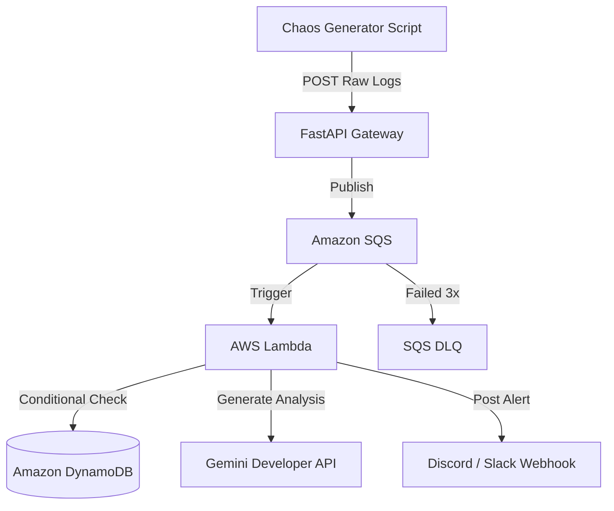

# Project Journey: AI Log Deduper

This document covers the system architecture, codebase layout, troubleshooting logs, and milestones for the AI Log Deduper project.

---

## 1. How the Pipeline Works

### Architectural Decisions and Trade-offs

An asynchronous SQS-to-Lambda queue architecture was selected to act as a buffer. This design protects the Gemini API from being overloaded by sudden bursts of raw application logs. Offloading log ingestion to the FastAPI gateway and buffering messages in SQS ensures the client receives an immediate response while allowing Lambda to process messages sequentially within API rate limits.

---

## 2. Codebase Structure

Here is the file structure and the purpose of each component in the repository:

### Foundational Configurations
- [.gitignore](./.gitignore): Excludes Python caches, virtual environments, and local credentials from Git.
- [.env.example](./.env.example): Template for local environment variables (API keys, SQS URLs).
- [docker-compose.yml](./docker-compose.yml): Configures LocalStack to emulate AWS SQS, DynamoDB, and SSM offline.
- [localstack-init.sh](./localstack-init.sh): Startup script to initialize AWS resources in LocalStack.
- [lambda_local_runner.py](./lambda_local_runner.py): Local script that polls SQS and runs the Lambda handler offline.

### Chaos Generator
- [chaos_generator/](./chaos_generator/): Test scripts to simulate application errors.
- [chaos.py](./chaos_generator/chaos.py): Simulator script that posts random tracebacks to the gateway every 10 seconds.
- [requirements.txt](./chaos_generator/requirements.txt): Dependencies for the simulator.

### FastAPI Gateway
- [gateway/](./gateway/): Gateway service code.
- [main.py](./gateway/main.py): FastAPI application that ingests logs, validates payloads, and sends messages to SQS.
- [Dockerfile](./gateway/Dockerfile): Docker build instructions for the gateway service.
- [requirements.txt](./gateway/requirements.txt): Python dependencies for the gateway.

### Lambda Processor
- [lambda/](./lambda/): Deduplication logic.
- [lambda_function.py](./lambda/lambda_function.py): AWS Lambda handler. Computes log MD5 hashes, performs the DynamoDB duplicate check, retrieves Gemini summaries, and posts alerts.
- [requirements.txt](./lambda/requirements.txt): Packaging requirements for the Lambda zip.

### Terraform Infrastructure (IaC)
- [terraform/](./terraform/): Terraform configuration files.
- [main.tf](./terraform/main.tf): Resource definitions including SQS queues, DLQ, IAM roles, Lambda triggers, DynamoDB table, and the CloudWatch dashboard.
- [ec2.tf](./terraform/ec2.tf): Provisions the m7i-flex.large EC2 instance, security groups, and IAM instance profile to host the FastAPI gateway container.
- [alerts.tf](./terraform/alerts.tf): Provisions the SQS DLQ CloudWatch alarm and SNS alerts topic for developer notification.
- [backend.tf](./terraform/backend.tf): Configures the remote S3 and DynamoDB backend for Terraform state tracking.
- [providers.tf](./terraform/providers.tf): Declares required providers (AWS, archive) and version constraints.
- [variables.tf](./terraform/variables.tf): Configures inputs like AWS region and SSM parameters.
- [outputs.tf](./terraform/outputs.tf): Declares resource outputs like SQS URLs and Lambda ARNs.
- [vpc.tf](./terraform/vpc.tf): Declares VPC configuration for the network layout.
- [terraform.tfvars](./terraform/terraform.tfvars): Local variable values (API keys and webhooks).

### Remote Backend Setup
- [terraform/bootstrap/](./terraform/bootstrap/): Setup files for the remote backend.
- [bootstrap/main.tf](./terraform/bootstrap/main.tf): Creates the S3 bucket and DynamoDB locking table used for Terraform remote state.
- [bootstrap/providers.tf](./terraform/bootstrap/providers.tf): Provider details for the bootstrap stage.
- [bootstrap/variables.tf](./terraform/bootstrap/variables.tf): Input variables for the bootstrap workspace.

### CI/CD Workflow
- [.github/workflows/deploy.yml](./.github/workflows/deploy.yml): GitHub Actions workflow. Runs Ruff linting, unit tests, security scans (TFLint, Checkov, Trivy), builds/pushes the Docker image, and runs `terraform apply`.

---

## 3. Comprehensive Troubleshooting Log

Issues I encountered during development and how I resolved them, grouped by development lifecycle stage:

### Phase 1: Local Development & Environment Mocking

#### FastAPI gateway fails with uvicorn: command not found
- **Symptom**: Starting the gateway inside the virtual environment failed.
- **Cause**: I forgot to install the gateway requirements inside the active virtual environment session.
- **Fix**: I installed dependencies with `pip install -r gateway/requirements.txt`.

#### LocalStack container exits with license activation failure
- **Symptom**: My container logs showed LocalStack returning with exit code 55 (license activation failed).
- **Cause**: Newer versions of LocalStack (2026.3.0+) require a valid auth token environment variable even for community features.
- **Fix**: I pinned the LocalStack image to version 3.8.0 in `docker-compose.yml` to run completely offline without an auth token.

#### Chaos generator would not stop via Ctrl + C
- **Symptom**: Pressing Ctrl + C did not terminate `chaos.py`.
- **Cause**: Network calls blocked the signal handler in the Python console.
- **Fix**: I terminated the process group using `pkill -f chaos.py`.

#### Lambda context object crash
- **Symptom**: My logs reported `AttributeError: LambdaContext object has no attribute epoch_now_ms`.
- **Cause**: Standard AWS Context does not provide timestamp attributes.
- **Fix**: I replaced it with Python's built-in `int(time.time())` function.

#### Pytest gateway import failure (ModuleNotFoundError)
- **Symptom**: Running `pytest` returned `ModuleNotFoundError: No module named 'gateway'`.
- **Cause**: The repository root directory was not included in Python's search path (`sys.path`) during collection.
- **Fix**: I executed Pytest using the `python -m pytest` command, which automatically prepends the current working directory to `sys.path`.

#### Pytest ValueError: unknown url type: 'mock-secret'
- **Symptom**: My Lambda unit test failed with `ValueError: unknown url type: 'mock-secret'`.
- **Cause**: My mock SSM parameters returned a plaintext mock key for the webhook URL, which `urllib` rejected as invalid.
- **Fix**: I updated the mocked parameter logic in `test_lambda.py` to return a valid HTTPS URL scheme for keys containing `webhook`.

#### AWS CLI fails to put SSM parameter containing HTTP URL
- **Symptom**: Parameter creation failed with `Error parsing parameter '--value': Unable to retrieve http://localhost:8000/mock-webhook: Could not connect to the endpoint URL`.
- **Cause**: AWS CLI automatically attempts to fetch the contents of arguments starting with `http://` or `https://` as external resources.
- **Fix**: I added `awslocal configure set cli_follow_urlparam false` to the top of `localstack-init.sh` to disable this automatic download behavior.

### Phase 2: Containerization & CI/CD Pipeline

#### GitHub Actions linting failure due to import ordering
- **Symptom**: My linting job failed with exit code 1.
- **Cause**: Ruff flagged E402 errors in my `lambda_function.py` because I imported `boto3` and `ClientError` after my logging configurations.
- **Fix**: I moved all imports to the very top of `lambda_function.py`.

#### GitHub Actions linting failure due to E402 imports in tests
- **Symptom**: My Ruff checks in the CI/CD pipeline failed with `E402 Module level import not at top of file`.
- **Cause**: I placed Python module imports (`os`/`sys`) after my helper logic, and the dynamic Lambda module import got flagged inside the mock patch context.
- **Fix**: I refactored `os`/`sys` imports to the top of `test_lambda.py` and added a `# noqa: E402` ignore flag to the dynamic `import lambda_function` statement.

#### Docker image build/push fails due to uppercase username
- **Symptom**: My build-and-push job failed with a message that the repository name must be lowercase.
- **Cause**: My repository owner identifier `cd-Emman` contains a capital letter 'E'. Docker tag specifications enforce lowercase letters.
- **Fix**: I added a bash step in `deploy.yml` using `tr '[:upper:]' '[:lower:]'` to dynamically convert the username to lowercase and referenced it in the image tags.

### Phase 3: Cloud Infrastructure & Deployment

#### Sensitive plan secrets committed
- **Symptom**: I noticed Terraform plan files (`tfplan`) showing up in my git diffs.
- **Cause**: I forgot to define plaintext plan files in my `.gitignore`.
- **Fix**: I appended `*.plan` and `*plan*` patterns to my `.gitignore`.

#### Stale terraform plans
- **Symptom**: My deployments ignored recent code changes.
- **Cause**: I was running `terraform apply tfplan` using a plan file generated before I modified the code files.
- **Fix**: I made sure to regenerate my plans (`terraform plan -out=tfplan`) after modifying code files.

#### SQS trigger mapping missing
- **Symptom**: My deployments returned no executions in CloudWatch.
- **Cause**: Destroying a single table cascaded and deleted my SQS-Lambda trigger mapping.
- **Fix**: I switched to full, untargeted `terraform apply` runs to restore all dependencies.

#### Lambda reserved concurrency errors
- **Symptom**: I got concurrency assignment errors during my deployments.
- **Cause**: Sandboxed AWS accounts require 10 unreserved concurrent executions, making my reservations fail.
- **Fix**: I reverted the concurrency configuration to `-1`.

#### Local state files lost during CI/CD execution
- **Symptom**: My local state files (`terraform.tfstate`) got lost on ephemeral runner runs.
- **Cause**: The default local backend store is non-persistent across CI/CD environments.
- **Fix**: I deployed an S3 state bucket and a DynamoDB locking table, migrated the state using `terraform init -migrate-state`, and deleted local state files.

#### Backend resources destroyed during standard application teardown
- **Symptom**: Running `terraform destroy` in my main workspace attempted to delete my S3 state bucket and DynamoDB locking table, breaking my remote backend access.
- **Cause**: I had defined backend infrastructure in the same workspace and state file as the application resources.
- **Fix**: I refactored backend resources into a separate directory (`terraform/bootstrap/`). I ran `terraform state rm` to decouple them from the main workspace database, ensuring they remain untouched during future application teardowns.

#### TFLint failure due to missing archive provider version constraint
- **Symptom**: My TFLint failed in the CI/CD pipeline with a warning about a missing version constraint for the "archive" provider.
- **Cause**: I used the `archive` provider in my `terraform/main.tf` but did not declare it in the `required_providers` block inside `terraform/providers.tf`.
- **Fix**: I added the `hashicorp/archive` provider with its version constraint to the `required_providers` block in `providers.tf`.

#### VPC Lambda DNS Resolution Failure
- **Symptom**: Deploying inside a private VPC subnet blocked outbound network activity.
- **Cause**: My Security Group egress rules blocked TCP/UDP port 53.
- **Fix**: I opened Security Group egress blocks to allow all outbound traffic.

#### NAT Gateway IP-Level rate limits
- **Symptom**: Running inside the VPC triggered persistent 429 errors from Google.
- **Cause**: Traffic routing through one NAT Gateway concentrated all my requests on a single IP.
- **Fix**: I removed VPC configurations in `terraform/main.tf` to use rotating AWS public IPs.

#### Lambda swallowed exceptions blocking SQS DLQ redrive
- **Symptom**: Failed messages were consumed but never routed to the Dead Letter Queue (DLQ).
- **Cause**: My Lambda event handler caught all general exceptions and returned a 200 status, which caused SQS to delete the message instead of retrying it.
- **Fix**: I updated `lambda_function.py` to raise the exception on processing errors, forcing SQS to trigger retries and correctly move the message to the DLQ after 3 failures.

#### Deployments ignored recent gateway code changes
- **Symptom**: My commits to the gateway service did not trigger updates on the live EC2 instance, causing the server to run outdated code.
- **Cause**: My Terraform EC2 user data referenced the static `latest` Docker tag. Because the image name string did not change, Terraform saw no differences and skipped redeploying the EC2 instance.
- **Fix**: I updated `.github/workflows/deploy.yml` to dynamically pass the unique Git commit SHA (`${{ github.sha }}`) as the `TF_VAR_gateway_image` variable to Terraform, forcing instance redeployments on every new push.

#### Cannot access EC2 instance shell for troubleshooting
- **Symptom**: My connection to port 8000 was refused, and I had no way to log into the server shell to debug without configuring SSH key pairs.
- **Cause**: My EC2 instance lacked the required IAM permissions to register with AWS Systems Manager (SSM) Session Manager.
- **Fix**: I attached the `AmazonSSMManagedInstanceCore` managed policy to my EC2 instance's IAM role, enabling secure browser-based terminal sessions directly from the AWS Console.

### Phase 4: Live Application Integration & Third-Party APIs

#### Gemini API HTTP 404 Error
- **Symptom**: My requests for summaries from Gemini failed with a 404.
- **Cause**: My endpoint targeted the deprecated model name `gemini-1.5-flash`.
- **Fix**: I updated the endpoint in my `lambda_function.py` to target `gemini-2.5-flash`.

#### Webhook alert rejected with HTTP 403 Forbidden
- **Symptom**: My webhook payloads were rejected by Discord.
- **Cause**: Discord blocks default Python `urllib` user-agent strings.
- **Fix**: I added a standard browser-like `User-Agent` header to our request payload.

#### Gemini API rate limit HTTP 429
- **Symptom**: My bursts of unique events failed with 429 errors from Google.
- **Cause**: My default SQS configuration batched 10 messages, firing them all concurrently and triggering API limits.
- **Fix**: I set `batch_size = 1` in my Terraform SQS trigger and updated the chaos generator sleep interval to 10 seconds.

#### Lambda Timeout during API Retries
- **Symptom**: My Lambda execution timed out after 15 seconds.
- **Cause**: My exponential backoff sleeps (2, 4, 8 seconds) exceeded the Lambda execution limit.
- **Fix**: I implemented a fail-fast fallback: if the API returns rate limits, I immediately send the raw traceback to Discord instead of retrying.

#### Sliding window rate limits
- **Symptom**: My success rate degraded on back-to-back testing.
- **Cause**: I hit the Gemini Free Tier rate-limiting rules.
- **Fix**: I allowed the rate-limit window to reset before initiating my next testing phase.

#### Peak capacity API drops (503 Service Unavailable)
- **Symptom**: Standard logs got dropped during sequential processing.
- **Cause**: I hit peak burst loads on the Gemini Free Tier endpoint.
- **Fix**: I built an exponential backoff loop inside my `lambda_function.py` to retry on 429 and 503 errors.

#### Unconfigured Gemini API key posted plain skip message instead of raw log
- **Symptom**: Leaving the Gemini API key blank or set to a mock string caused the Lambda to send `"Gemini API key not configured. Logging error analysis skipped."` as the Discord notification payload rather than falling back to the raw log layout.
- **Cause**: My fallback checks in `lambda_function.py` only caught errors containing `"Error analyzing log via Gemini"`, bypassing the unconfigured check.
- **Fix**: I refactored the code to return `None` on unconfigured or mock keys, and modified the fallback check to automatically trigger the raw log layout if the analysis is empty.

---

## 4. Completed Milestones & Roadmap

- ✔ **CI/CD Pipeline Automation**: Created a GitHub Actions workflow to run Ruff, build/push the FastAPI Docker container, and run `terraform apply` automatically on pushes to `master`.
- ✔ **Infrastructure Resilience**: Set up SQS DLQ with a `maxReceiveCount` of 3 to isolate failed logs, implemented a redrive mechanism to re-process them, and configured a CloudWatch metric alarm with SNS notifications for instant alerting.
- ✔ **Security Enhancements (SSM)**: Swapped plaintext variables for AWS Systems Manager (SSM) Parameter Store SecureString parameters to fetch keys at runtime.
- ✔ **CI/CD Security Scanners**: Integrated Checkov, TFLint, and Trivy scanning into the CI/CD pipeline.
- ✔ **Automated Testing**: Integrated Pytest into the pipeline to test FastAPI and Lambda logic.
- ✔ **Local Development Infrastructure**: Configured `docker-compose.yml` with LocalStack to run the queue, database, and parameter store offline.
- ✔ **Infrastructure Monitoring**: Created a custom CloudWatch dashboard tracking SQS queue metrics, Lambda errors, and DynamoDB capacity.
- ✔ **FastAPI Gateway Cloud Deployment**: Migrated the FastAPI ingestion gateway from local Docker environments to a live, self-hosted EC2 instance (m7i-flex.large) running Docker via User Data automation.
